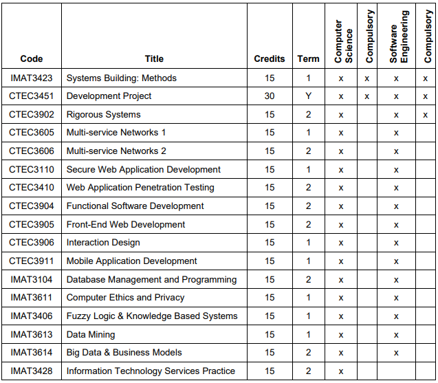

README

This is an assignment provided by De Montfort University for CTEC2906 Object-Oriented Development
to demonstrate student's ability to design and implement an OO system consisting of a set of Java
classes, using advanced libraries within the Java SDK.

In this assignment I have demonstrate the designed system ability of second year computing students in 
De MontfortUniversity to select their final year module options. There are compulsory modules tht must
be selected based on the course of study, and others that are only associated with certain courses.
Modules either run in term 1 or 2, or all year long (Development Project).

For this I have built an interactive graphical user interface (GUI) that dynamically allows modules
to be selected based on the chosen course of study, computer science and software engineering, and
then stores this information. The application is designed to be user-friendly and contain appropriate
validation to ensure only a legitimate selection of modules is made.

Each modules contains their credit ammount, and whether they are optional or compulsory for Computer
Science and Software Engineering students. In total 120 credits must be selected via any legitimate
combination of modules, but crucially studnets may only select 60 credits per term. The yearlong
compulsory module CTEC3451 contributes towards 15 credits in each term.

As an example, a Computer Science student would have by default 30 credits selected in term 1 and 15
credits in term 2 due to the mandatory nature of IMAT3423 (15 Credits Term 1) and 
CTEC3451 (30 Credits Year Long). This would mean they would need to select a further 30 credits of 
term 1 modules, and a further 45 credits in term 2. A Software Engineering student would be similar,
but would additionally have the mandatory module CTEC3902 in term 2, therefore, the system requires
an additional 30 credits worth of modules to be chosen in both term 1 and 2.

In below table overleaf shows all of the avilable module, their credit amount and whether they are
optional or mandatory for both Computer Science and Software Engineering students.

